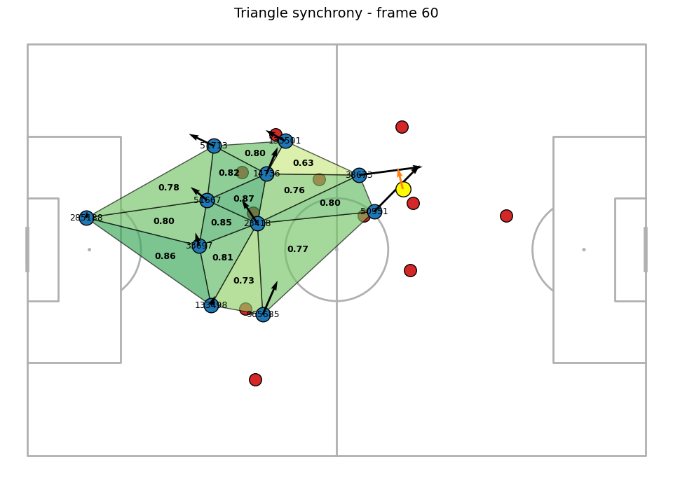
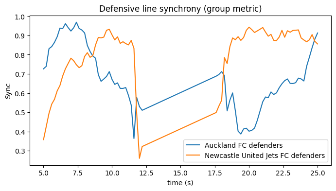

# Group Synchronization Index

**Submission for the SkillCorner X PySport Analytics Cup 2026 — Research Track**

A metric for measuring how well football players move together using tracking data, computable for local player groups (Delaunay triangles) or any custom group of players — using only open SkillCorner data.

## Overview

Tracking data give player positions over time, but describing "team movement" with a single number is not straightforward. The **Group Synchronization Index (GSI)** offers an easy, interpretable measure of coordination that analysts can compute quickly.

For each player, speed, movement direction, and changes in acceleration (impulse) are computed. Directional alignment is measured relative to the ball, inspired by the Kuramoto synchronization model. Three components — direction alignment, speed consistency, and impulse consistency — are combined into a single, weighted, normalized synchrony score between 0 and 1.

## Method

**Direction alignment** is a speed-weighted Kuramoto order parameter, computed over each player's heading angle relative to the ball ($\varphi_i$):

$$R_{dir} = \left| \frac{\sum_i w_i \, e^{\,i\varphi_i}}{\sum_i w_i} \right|, \qquad w_i = \frac{v_i}{\sum_j v_j}$$

$R_{dir} = 1$ means every player moves in the same direction relative to the ball; only players above a minimum speed threshold are included.

**Speed consistency** checks whether players move at a similar pace:

$$S_{speed} = \text{clip}\!\left(1 - \frac{\sigma_v}{\mu_v + \epsilon},\; 0,\; 1\right)$$

**Impulse consistency** checks whether players start or adjust movement at the same time, using a robust dispersion measure (median absolute deviation) on acceleration changes:

$$S_{dacc} = 1 - \text{clip}\!\left(\frac{\text{MAD}(\Delta a)}{|\text{median}(\Delta a)| + \text{MAD}(\Delta a)},\; 0,\; 1\right)$$

The final score blends the three terms with default weights ($w_{dir}=0.5$, $w_{spd}=0.3$, $w_{dacc}=0.2$):

$$\text{Sync} = \frac{w_{dir} R_{dir} + w_{spd} S_{speed} + w_{dacc} S_{dacc}}{w_{dir} + w_{spd} + w_{dacc}}$$

The score can be computed for Delaunay triangles or for any custom list of player IDs (e.g. a back four). Weights are configurable for different analysis goals.

## Example: defensive line synchrony over time

GSI computed for the defensive line of both teams over a 20-second window, showing periods of high and low coordination as the line drops or steps up together.

## Repository structure

- [`submission.ipynb`](submission.ipynb) — main notebook, submission entry point
- [`abstract.md`](abstract.md) — Research Track abstract (Introduction, Methods, Results, Conclusion)
- `src/` — GSI computation, triangle extraction, and visualization code

## Data

Uses the open [SkillCorner tracking data](https://github.com/SkillCorner/opendata) — loaded directly, not stored in this repository.

## Context

Submitted to the [SkillCorner X PySport Analytics Cup 2026](https://pysport.org/analytics-cup/).
